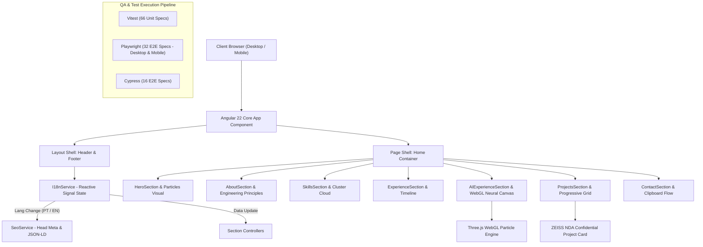
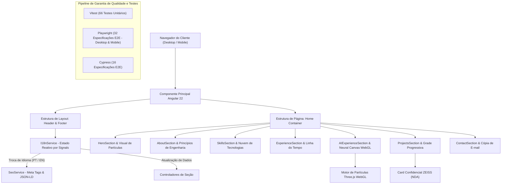

<div align="center">

# ⚡ Yuri Vieira — Portfólio Angular 22 / Frontend Engineering Portfolio


**PT-BR:** Aplicação web frontend desenvolvida em Angular 22 com Signals, gráficos interativos Three.js (WebGL), suporte trilíngue (i18n - PT-BR, EN, ES), SEO dinâmico e suíte tripla de testes automatizados.  
*Slogan: Design system proprietário, animações de alta performance e suíte de testes ponta a ponta.*

**EN:** Frontend web application built with Angular 22 Signals, Three.js (WebGL) interactive visuals, dynamic tri-lingual i18n (PT-BR, EN, ES), SEO engine, and a triple automated testing suite.  
*Slogan: Custom design system, high-performance animations, and end-to-end testing pipeline.*

---

### 👤 Autor / Author

| Papel / Role | Nome / Name | GitHub Profile | Aplicação em Produção / Live Link |
| :--- | :--- | :--- | :--- |
| **Engenheiro de Software / Full Stack** | Yuri Vieira | [@DevYuriVieira](https://github.com/DevYuriVieira) | [devyurivieira.vercel.app](https://devyurivieira.vercel.app/) |

---

### 🌐 Aplicação em Produção / Live Demo

[https://devyurivieira.vercel.app/](https://devyurivieira.vercel.app/)

---

[🌐 Versão em Português](#versao-em-portugues) &nbsp;|&nbsp; [🌐 English Version](#english-version)

</div>

---

<a id="english-version"></a>
# 🇺🇸 English Version

## Table of Contents
- [Project Overview](#-project-overview)
- [Comprehensive Feature Breakdown](#-comprehensive-feature-breakdown)
  - [1. Modern Angular Signals & Architecture](#1-modern-angular-signals--architecture)
  - [2. WebGL 3D Particle Shaders & Neural Canvas](#2-webgl-3d-particle-shaders--neural-canvas)
  - [3. Case Studies & Progressive Grid Expansion](#3-case-studies--progressive-grid-expansion)
  - [4. ZEISS Confidential Project Card & Legal NDA Disclaimer](#4-zeiss-confidential-project-card--legal-nda-disclaimer)
  - [5. Reactive i18n & Dynamic SEO Engine](#5-reactive-i18n--dynamic-seo-engine)
  - [6. Contact Flow & Asynchronous Clipboard Action](#6-contact-flow--asynchronous-clipboard-action)
  - [7. Triple Testing Pipeline (Vitest + Playwright + Cypress)](#7-triple-testing-pipeline-vitest--playwright--cypress)
- [System Architecture & Component Flow](#-system-architecture--component-flow)
- [Tech Stack & Ecosystem](#-tech-stack--ecosystem)
- [Project Directory Structure](#-project-directory-structure)
- [Data Models & Type Definitions](#-data-models--type-definitions)
- [Getting Started & Local Execution](#-getting-started--local-execution)
- [Available Test Commands](#-available-test-commands)
- [Troubleshooting & Future Roadmap](#-troubleshooting--future-roadmap)
- [License](#-license)

---

## 🚀 Project Overview

The **Yuri Vieira Portfolio** is a single-page frontend application built with **Angular 22** using standalone component architecture, fine-grained Signals, custom SCSS design tokens, interactive WebGL 3D particle animations (Three.js), and a complete multi-framework testing suite (**Vitest**, **Playwright**, and **Cypress**).

Key Engineering Highlights:
1. **Modern Angular Architecture**: Uses Angular Standalone Components, native Signals (`signal`, `computed`), and `ChangeDetectionStrategy.OnPush` across all views for low memory footprint and fast rendering.
2. **GPU Visual FX**: Interactive 3D particle visuals powered by **Three.js** (`NeuralCanvasComponent` and `HeroParticlesVisual`), including raycasting mouse displacement, floating glassmorphic zoom controls (`+`, `-`, `Reset`, `Focus`), and automatic responsive fallbacks on mobile screens (<768px).
3. **13 Detailed Engineering Case Studies**: Highlights real-world projects, architecture trade-offs, technical decisions, and a dedicated ZEISS NDA confidential project card with lock badge 🔒.
4. **Triple-Layer QA Architecture**: 100% passing tests combining unit tests (**Vitest**), multi-browser/mobile E2E testing (**Playwright**), and visual E2E verification (**Cypress**).

---

## ✨ Comprehensive Feature Breakdown

### 1. Modern Angular Signals & Architecture
- **State Management**: Built on native Angular Signals (`signal()`, `computed()`) without third-party state managers.
- **OnPush Strategy**: Every component enforces `changeDetection: ChangeDetectionStrategy.OnPush`.
- **Custom UI Library (`@ui`)**: Independent design system primitives including `Container`, `Section`, `Heading`, `Text`, `Button`, `Card`, `Badge`, and `Link`.

### 2. WebGL 3D Particle Shaders & Neural Canvas
- **Three.js Particle System (`NeuralCanvasComponent`)**: Custom GPU particle shader rendering points connected by dynamic distance lines.
- **Raycasting Mouse Interaction**: Particles respond dynamically to cursor movement and touch events.
- **Control Toolbar**: Glassmorphic floating UI offering Zoom In (`+`), Zoom Out (`-`), Reset Camera, and Target Focus controls.
- **Mobile Fallback**: WebGL canvas automatically hidden on viewports under `768px` to preserve mobile battery life and maintain 60 FPS scrolling.

### 3. Case Studies & Progressive Grid Expansion
- **13 Case Studies**: Structured breakdown featuring Challenge, Solution, Architecture Decisions, Technical Highlights, Results, and Tech Stack badges.
- **3-Stage Progressive Expansion**: Initial 5 featured items → 7 expanded items → All 13 projects → Smooth scroll collapse back to 5 items.

### 4. ZEISS Confidential Project Card & Legal NDA Disclaimer
- **Residency Project Presentation**: Highlights enterprise software developed for **ZEISS** during the Serratec TIC Residency.
- **Visual Lock Badge 🔒**: Displays confidential status while showcasing technical accomplishments without exposing restricted source code.

### 5. Reactive i18n & Dynamic SEO Engine
- **Tri-Lingual Support (PT-BR / EN / ES)**: Reactive language switching across Portuguese, English, and Spanish powered by `I18nService` without page reloads.
- **Dynamic Meta Management (`SeoService`)**: Automatically updates `<title>`, `<meta name="description">`, Open Graph tags (`og:title`, `og:image`, `og:url`), Twitter Cards (`twitter:card`), and JSON-LD structured schemas upon language changes.

### 6. Contact Flow & Asynchronous Clipboard Action
- **Fluid Typography Clamping**: E-mail string formatted with CSS `clamp()` and `word-break: break-word` to fit on 375px mobile viewports without horizontal overflow.
- **One-Click Clipboard Copying**: Asynchronous `navigator.clipboard` integration with instant visual state feedback (*"Copied!"* / *"Copiado!"*).
- **Direct Mail Composer**: Quick action links delegating to Gmail composer and system `mailto:`.

### 7. Triple Testing Pipeline (Vitest + Playwright + Cypress)
- **Unit & Integration Testing (Vitest)**: 66 automated tests validating components, directives, and services.
- **End-to-End Testing (Playwright)**: 32 E2E specs running concurrently across **Desktop Chromium** and **Mobile Pixel 7** viewports.
- **End-to-End Visual Verification (Cypress)**: 16 E2E specs validating user journeys in the Cypress Test Runner.

---

## 🏗️ System Architecture & Component Flow



---

## 🛠 Tech Stack & Ecosystem

| Layer / Technology | Version | Purpose |
| :--- | :--- | :--- |
| **Core Framework** | Angular `^22.1.0` | Standalone UI architecture, Signals, and OnPush change detection |
| **Language** | TypeScript `~6.0.2` | Static typing, interfaces, and strict domain models |
| **3D Engine & Shaders** | Three.js `^0.185.1` | GPU particle shader visual system and raycasting |
| **Design System** | SCSS / SASS | Custom CSS variables, glassmorphism, and responsive mixins (No UI Libraries) |
| **Unit Testing** | Vitest `^4.0.8` | Component and unit test execution engine |
| **E2E Testing (Multi-Browser)**| Playwright `^1.62.1` | Concurrency testing across Desktop Chrome and Mobile Pixel 7 |
| **E2E Testing (Visual Runner)** | Cypress `^15.20.0` | Interactive E2E assertions and visual runner |
| **Code Formatter** | Prettier `^3.8.1` | Automated code formatting and style consistency |

---

## 📁 Project Directory Structure

```text
src/
├── app/
│   ├── core/                  # Core services, SEO engine, and i18n state
│   │   ├── i18n/              # I18nService, supported languages, and dictionary loaders
│   │   └── services/          # SeoService, meta tag updater, and JSON-LD injector
│   ├── layout/                # Global layout shell components
│   │   ├── header/            # Navigation header, brand logo, and flag language switcher
│   │   └── footer/            # Footer social links, copyright, and navigation anchors
│   ├── pages/                 # Main application view pages
│   │   └── home/              # Main portfolio home view controller
│   │       ├── home.ts        # Home controller managing section composition
│   │       └── sections/      # Section view modules
│   │           ├── about/         # About me, career journey, and engineering principles
│   │           ├── ai-experience/ # AI RAG projects & WebGL Neural Canvas component
│   │           ├── contact/       # Contact card, email composer, and clipboard copy action
│   │           ├── experience/    # Career timeline milestones and focus cards
│   │           ├── hero/          # Hero section, CTA actions, and particle visual background
│   │           ├── projects/      # 13 case studies grid & ZEISS NDA confidential card
│   │           └── skills/        # 4 technical clusters & tag cloud badges
│   ├── shared/                # Shared directives and animations
│   │   └── directives/        # RevealDirective (IntersectionObserver scroll animations)
│   └── ui/                    # Standalone UI Design System primitives (@ui)
│       ├── badge/             # Tech stack tag badges
│       ├── button/            # Standardized button component
│       ├── container/         # Grid container wrapper
│       ├── heading/           # Typography headings (H1-H6)
│       ├── link/              # Accessible anchor links
│       ├── section/           # Section container wrapper
│       └── text/              # Body text typography
├── assets/                    # Favicon icons, OG social images, and PDF resume download
├── styles/                    # SCSS design system tokens, CSS variables, and mixins
├── e2e/                       # Playwright E2E test suite (portfolio.spec.ts)
├── cypress/                   # Cypress E2E test suite (portfolio.cy.ts)
└── index.html                 # Main HTML entry point & primary SEO meta tags
```

---

## 📊 Data Models & Type Definitions

### Case Study Model (`src/app/pages/home/sections/projects/projects.model.ts`)

```typescript
export interface ProjectItem {
  readonly id: string;
  readonly title: string;
  readonly period: string;
  readonly isConfidential?: boolean;
  readonly challenge: string;
  readonly solution: string;
  readonly archDecisions: readonly string[];
  readonly techHighlights: readonly string[];
  readonly results: string;
  readonly techStack: readonly string[];
  readonly repoUrl?: string;
  readonly liveUrl?: string;
}
```

### SEO Configuration Interface (`src/app/core/services/seo.service.ts`)

```typescript
export interface SeoConfig {
  readonly title?: string;
  readonly description?: string;
  readonly keywords?: string;
  readonly url?: string;
  readonly image?: string;
}
```

---

## ⚡ Getting Started & Local Execution

### Prerequisites
- Node.js `v20.x` or higher (`v22+` recommended)
- npm `v10.x` or higher

### Local Setup
```bash
# Clone the repository
git clone https://github.com/DevYuriVieira/portfolio.git
cd portfolio

# Install dependencies
npm install

# Launch local dev server
npm start
```

Access in your browser at `http://localhost:4200`.

---

## 📜 Available Test Commands

| Script | Tool | Action Description |
| :--- | :--- | :--- |
| `npm start` | **Angular CLI** | Starts local dev server at `http://localhost:4200` |
| `npm run build` | **Angular Build** | Compiles production bundle into `/dist/portfolio` |
| `npm test` | **Vitest** | Executes 66 unit & component tests |
| `npm run test:e2e` | **Playwright** | Executes 32 E2E specs concurrently (Desktop Chrome & Mobile Pixel 7) |
| `npm run test:cypress` | **Cypress** | Executes 16 E2E specs in headless runner |
| `npm run cypress:open` | **Cypress UI** | Opens interactive Cypress Test Runner GUI |

---

## 📝 Troubleshooting & Future Roadmap

> [!IMPORTANT]
> **Mobile Canvas Fallback**: The 3D WebGL Neural Canvas is intentionally hidden on viewports smaller than `768px` via SCSS media queries (`@include respond-to('md')`) to prevent battery drain and maintain 60 FPS scrolling on mobile devices.

> [!TIP]
> **Test Execution Note**: Before running Playwright (`npm run test:e2e`) or Cypress (`npm run test:cypress`), ensure the dev server is active on `http://localhost:4200` or allow Playwright's automatic `webServer` runner to launch it.

### Future Roadmap
- [ ] PWA offline service worker caching for assets.
- [ ] Interactive 3D WebGL architecture diagram viewer for case studies.
- [ ] Automated Lighthouse CI audit integration in GitHub Actions pipeline.

---

## 📄 License

Developed by **Yuri Vieira**. All rights reserved.

---
---

<a id="versao-em-portugues"></a>
# 🇧🇷 Versão em Português

## Sumário
- [Visão Geral do Projeto](#-visão-geral-do-projeto-1)
- [Detalhamento Completo de Funcionalidades](#-detalhamento-completo-de-funcionalidades-1)
  - [1. Arquitetura Reativa Moderna com Angular Signals](#1-arquitetura-reativa-moderna-com-angular-signals-2)
  - [2. Neural Canvas 3D GPU com WebGL](#2-neural-canvas-3d-gpu-com-webgl-1)
  - [3. Casos de Estudo Corporativos & Grade Progressiva](#3-casos-de-estudo-corporativos--grade-progressiva-2)
  - [4. Card de Projeto Confidencial ZEISS & Tratamento de NDA](#4-card-de-projeto-confidencial-zeiss--tratamento-de-nda-2)
  - [5. Suporte Trilíngue (i18n) & Motor Dinâmico de SEO](#5-suporte-trilíngue-i18n--motor-dinâmico-de-seo-2)
  - [6. Seção de Contato de Alta Conversão & Cópia no Clipboard](#6-seção-de-contato-de-alta-conversão--cópia-no-clipboard-2)
  - [7. Suíte Tripla de Testes (Vitest + Playwright + Cypress)](#7-suíte-tripla-de-testes-vitest--playwright--cypress-2)
- [Arquitetura do Sistema & Fluxo de Componentes](#-arquitetura-do-sistema--fluxo-de-componentes)
- [Ecossistema & Tecnologias Utilizadas](#-ecossistema--tecnologias-utilizadas-1)
- [Estrutura Detalhada do Projeto](#-estrutura-detalhada-do-projeto-1)
- [Modelos de Dados & Definições de Tipos](#-modelos-de-dados--definições-de-tipos)
- [Como Executar o Projeto](#-como-executar-o-projeto-1)
- [Comandos de Scripts & Testes Disponíveis](#-comandos-de-scripts--testes-disponíveis-1)
- [Solução de Problemas & Roadmap Futuro](#-solução-de-problemas--roadmap-futuro-1)
- [Licença](#-licença-1)

---

## 🚀 Visão Geral do Projeto

O **Portfólio de Yuri Vieira** é uma aplicação web frontend desenvolvida em **Angular 22** utilizando arquitetura de componentes standalone, Signals nativos, design system próprio em SCSS, animações GPU 3D com Three.js e uma suíte completa de testes automatizados (**Vitest**, **Playwright** e **Cypress**).

Destaques de Engenharia:
1. **Arquitetura Angular Moderna**: Componentes Standalone, Signals nativos (`signal`, `computed`) e `ChangeDetectionStrategy.OnPush` em todas as visões para alta velocidade de renderização e baixo uso de memória.
2. **Efeitos Visuais Acelerados por GPU**: Shaders de partículas WebGL 3D em **Three.js** (`NeuralCanvasComponent` e `HeroParticlesVisual`), com interatividade por cursor, barra flutuante de zoom (`+`, `-`, `Reset`, `Foco`) e fallback automático para telas móveis (<768px).
3. **13 Casos de Estudo de Engenharia**: Apresentação de projetos com trade-offs de arquitetura, decisões técnicas e um card de projeto confidencial da ZEISS com selo de bloqueio 🔒.
4. **Garantia de Qualidade em 3 Camadas**: 100% dos testes aprovados unindo testes unitários (**Vitest**), testes E2E multi-browser e mobile (**Playwright**) e validação visual E2E (**Cypress**).

---

## ✨ Detalhamento Completo de Funcionalidades

### 1. Arquitetura Reativa Moderna com Angular Signals
- **Gerenciamento de Estado**: Baseado 100% em Signals nativos do Angular (`signal()`, `computed()`), sem bibliotecas externas de estado.
- **Estratégia OnPush**: Todos os componentes da interface utilizam `changeDetection: ChangeDetectionStrategy.OnPush`.
- **Biblioteca de Componentes Modulares (`@ui`)**: Primitivas do design system contendo `Container`, `Section`, `Heading`, `Text`, `Button`, `Card`, `Badge` e `Link`.

### 2. Neural Canvas 3D GPU com WebGL
- **Shader de Partículas em Three.js (`NeuralCanvasComponent`)**: Renderiza pontos de partículas na GPU conectados por linhas dinâmicas de proximidade.
- **Interatividade por Raycasting**: As partículas reagem em tempo real ao movimento do mouse ou gestos de toque no celular.
- **Barra Flutuante de Controle de Zoom**: Toolbar com efeito de vidro (glassmorphism) com botões de Zoom In (`+`), Zoom Out (`-`), Reset de Câmera e Foco Centralizado.
- **Desempenho Adaptativo**: O canvas WebGL é ocultado automaticamente em telas menores que `768px` para preservar a bateria e a fluidez em dispositivos móveis.

### 3. Casos de Estudo Corporativos & Grade Progressiva
- **13 Casos de Estudo de Engenharia**: Estruturados com Desafio, Solução, Decisões de Arquitetura, Destaques Técnicos, Resultados e Badges de Tecnologias.
- **Grade Progressiva em 3 Etapas**: Exibição inicial de 5 projetos em destaque → Expansão para 7 projetos → Expansão completa para 13 projetos → Recolhimento com rolagem suave de volta para 5 itens.

### 4. Card de Projeto Confidencial ZEISS & Tratamento de NDA
- **Apresentação de Projeto de Residência**: Exibe a aplicação desenvolvida para a **ZEISS** dentro do programa de Residência Tecnológica Serratec TIC.
- **Selo de Bloqueio 🔒**: Destaca o status confidencial do projeto e apresenta as conquistas técnicas sem expor código-fonte restrito.

### 5. Suporte Trilíngue (i18n) & Motor Dinâmico de SEO
- **Alternância Instantânea de Idioma (PT-BR / EN / ES)**: Troca reativa entre Português, Inglês e Espanhol via `I18nService` sem recarregamento da página.
- **Motor Dinâmico de SEO (`SeoService`)**: Atualiza automaticamente as tags `<title>`, `<meta name="description">`, Open Graph (`og:title`, `og:image`, `og:url`), Twitter Cards (`twitter:card`) e esquemas estruturados JSON-LD ao alternar entre idiomas.

### 6. Seção de Contato de Alta Conversão & Cópia no Clipboard
- **Tipografia Fluida com Clamping**: Formatação do e-mail com `clamp()` do CSS e `word-break: break-word` para caber em uma única linha mesmo em telas de 375px sem rolagem horizontal.
- **Cópia para a Área de Transferência**: Integração assíncrona com `navigator.clipboard` com feedback visual imediato (*"Copiado!"* / *"Copied!"*).
- **Envio Direto de E-mail**: Links de ação rápida direcionando para o editor do Gmail e `mailto:` do sistema.

### 7. Suíte Tripla de Testes (Vitest + Playwright + Cypress)
- **Testes Unitários & de Integração (Vitest)**: 66 testes automatizados validando componentes, diretivas e serviços.
- **Testes Ponta a Ponta (Playwright)**: 32 especificações E2E executadas em paralelo em visores de **Desktop Chrome** e **Mobile Pixel 7**.
- **Validação Visual E2E (Cypress)**: 16 especificações E2E validando os fluxos completos no Cypress Test Runner.

---

## 🏗️ System Architecture & Component Flow



---

## 🛠 Ecossistema & Tecnologias Utilizadas

| Camada / Tecnologia | Versão | Função no Projeto |
| :--- | :--- | :--- |
| **Framework Principal** | Angular `^22.1.0` | Arquitetura Standalone, Signals e detecção OnPush |
| **Linguagem** | TypeScript `~6.0.2` | Tipagem estática rigorosa e modelos de domínio DTO |
| **Motor 3D & Shaders** | Three.js `^0.185.1` | Sistema visual de partículas GPU WebGL e interatividade |
| **Design System** | SCSS / SASS | Variáveis CSS nativas, glassmorphism e utilitários (Sem bibliotecas de UI) |
| **Testes Unitários** | Vitest `^4.0.8` | Framework de testes unitários ultrarrápido para Angular |
| **Testes E2E (Multi-Browser)**| Playwright `^1.62.1` | Testes paralelos em visores Desktop Chrome e Mobile Pixel 7 |
| **Testes E2E (Visual Runner)** | Cypress `^15.20.0` | Execução interativa e validação visual de fluxos E2E |
| **Formatador de Código** | Prettier `^3.8.1` | Padronização e formatação de estilo de código |

---

## 📁 Estrutura Detalhada do Projeto

```text
src/
├── app/
│   ├── core/                  # Serviços centrais, motor de SEO e estado i18n
│   │   ├── i18n/              # I18nService, idiomas suportados e dicionários
│   │   └── services/          # SeoService, atualização de meta tags e JSON-LD
│   ├── layout/                # Componentes da estrutura global de layout
│   │   ├── header/            # Cabeçalho, logotipo e seletor de idiomas
│   │   └── footer/            # Rodapé, links sociais e marcas registradas
│   ├── pages/                 # Páginas principais da aplicação
│   │   └── home/              # Controlador da página Home do portfólio
│   │       ├── home.ts        # Controlador principal das seções
│   │       └── sections/      # Módulos visuais de cada seção
│   │           ├── about/         # Sobre mim, trajetória e princípios de engenharia
│   │           ├── ai-experience/ # Projetos de IA e componente Neural Canvas WebGL
│   │           ├── contact/       # Card de contato, compositor de e-mail e cópia
│   │           ├── experience/    # Linha do tempo profissional e cards de foco
│   │           ├── hero/          # Seção Hero, botões de ação e partículas de fundo
│   │           ├── projects/      # Grade com 13 projetos e card confidencial ZEISS
│   │           └── skills/        # 4 grupos de habilidades e badges em nuvem
│   ├── shared/                # Diretivas e animações compartilhadas
│   │   └── directives/        # RevealDirective (Animações via IntersectionObserver)
│   └── ui/                    # Componentes primitivos do Design System (@ui)
│       ├── badge/             # Badges e etiquetas de tecnologia
│       ├── button/            # Botão padronizado
│       ├── container/         # Grid container
│       ├── heading/           # Títulos de tipografia
│       ├── link/              # Anchor links acessíveis
│       ├── section/           # Invólucro de seção
│       └── text/              # Tipografia de texto
├── assets/                    # Favicons, imagem Open Graph e download do currículo PDF
├── styles/                    # Tokens, variáveis CSS e mixins do Design System SCSS
├── e2e/                       # Suíte de testes E2E Playwright (portfolio.spec.ts)
├── cypress/                   # Suíte de testes E2E Cypress (portfolio.cy.ts)
└── index.html                 # Ponto de entrada HTML e tags SEO base
```

---

## 📊 Modelos de Dados & Definições de Tipos

### Modelo de Caso de Estudo (`src/app/pages/home/sections/projects/projects.model.ts`)

```typescript
export interface ProjectItem {
  readonly id: string;
  readonly title: string;
  readonly period: string;
  readonly isConfidential?: boolean;
  readonly challenge: string;
  readonly solution: string;
  readonly archDecisions: readonly string[];
  readonly techHighlights: readonly string[];
  readonly results: string;
  readonly techStack: readonly string[];
  readonly repoUrl?: string;
  readonly liveUrl?: string;
}
```

### Configuração Dinâmica de SEO (`src/app/core/services/seo.service.ts`)

```typescript
export interface SeoConfig {
  readonly title?: string;
  readonly description?: string;
  readonly keywords?: string;
  readonly url?: string;
  readonly image?: string;
}
```

---

## ⚡ Como Executar o Projeto

### Pré-requisitos
- Node.js `v20.x` ou superior (recomendado `v22+`)
- npm `v10.x` ou superior

### Execução Local
```bash
# Clonar o repositório
git clone https://github.com/DevYuriVieira/portfolio.git
cd portfolio

# Instalar dependências
npm install

# Iniciar servidor local
npm start
```

Acesse no navegador pelo endereço `http://localhost:4200`.

---

## 📜 Comandos de Scripts & Testes Disponíveis

| Script | Ferramenta | Descrição da Ação |
| :--- | :--- | :--- |
| `npm start` | **Angular CLI** | Inicia o servidor de desenvolvimento em `http://localhost:4200` |
| `npm run build` | **Angular Build** | Compila os arquivos de produção na pasta `/dist/portfolio` |
| `npm test` | **Vitest** | Executa 66 testes unitários e de componente |
| `npm run test:e2e` | **Playwright** | Executa 32 testes E2E em paralelo (Desktop & Mobile Pixel 7) |
| `npm run test:cypress` | **Cypress** | Executa 16 testes E2E no executor headless do Cypress |
| `npm run cypress:open` | **Cypress UI** | Abre a interface gráfica interativa do Cypress Test Runner |

---

## 📝 Solução de Problemas & Roadmap Futuro

> [!IMPORTANT]
> **Nota de Desempenho Mobile**: O canvas 3D WebGL Neural Canvas é ocultado automaticamente em telas menores que `768px` via CSS (`@include respond-to('md')`) para evitar consumo excessivo de bateria e manter a fluidez de 60 FPS em celulares.

> [!TIP]
> **Execução de Testes E2E**: Antes de rodar os comandos do Playwright (`npm run test:e2e`) ou Cypress (`npm run test:cypress`), certifique-se de que o servidor local está ativo em `http://localhost:4200` ou permita que a inicialização automática ocorra.

### Roadmap Futuro
- [ ] Cache offline PWA de ativos do projeto.
- [ ] Visualizador de diagramas de arquitetura 3D interativo para os casos de estudo.
- [ ] Automação de auditoria do Lighthouse CI nas GitHub Actions.

---

## 📄 Licença

Desenvolvido por **Yuri Vieira**. Todos os direitos reservados.

<div align="center">
  <sub>Portfólio de Engenharia de Software • Software Engineering Portfolio</sub>
</div>
