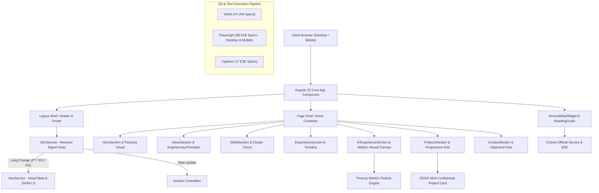
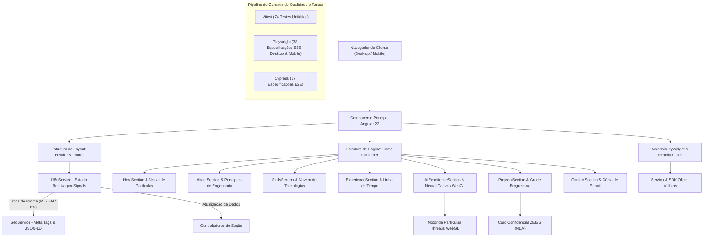

<div align="center">

# ⚡ Yuri Vieira — Portfólio Angular 22 / Frontend Engineering Portfolio


**PT-BR:** Aplicação web frontend desenvolvida em Angular 22 com Signals, gráficos interativos Three.js (WebGL), motor avançado de acessibilidade (WCAG AAA & VLibras), suporte trilíngue (i18n - PT-BR, EN, ES), SEO dinâmico e suíte tripla de testes automatizados.  
*Slogan: Design system proprietário, acessibilidade universal com VLibras, animações de alta performance e suíte de testes ponta a ponta.*

**EN:** Frontend web application built with Angular 22 Signals, Three.js (WebGL) interactive visuals, universal accessibility engine (WCAG AAA & VLibras), dynamic tri-lingual i18n (PT-BR, EN, ES), SEO engine, and a triple automated testing suite.  
*Slogan: Custom design system, universal accessibility with VLibras, high-performance animations, and end-to-end testing pipeline.*

---

### 👤 Autor / Author

| Papel / Role | Nome / Name | GitHub Profile | Aplicação em Produção / Live Link |
| :--- | :--- | :--- | :--- |
| **Engenheiro de Software / Full Stack** | Yuri Vieira | [@DevYuriVieira](https://github.com/DevYuriVieira) | [devyurivieira.vercel.app](https://devyurivieira.vercel.app/) |

---

### 🌐 Aplicação em Produção / Live Demo

[https://devyurivieira.vercel.app/](https://devyurivieira.vercel.app/)

---

[🌐 Versão em Português](#versao-em-portugues) &nbsp;|&nbsp; [🌐 English Version](#english-version)

</div>

---

<a id="english-version"></a>
# 🇺🇸 English Version

## Table of Contents
- [Project Overview](#-project-overview)
- [Comprehensive Feature Breakdown](#-comprehensive-feature-breakdown)
  - [1. Modern Angular Signals & Architecture](#1-modern-angular-signals--architecture)
  - [2. WebGL 3D Particle Shaders & Neural Canvas](#2-webgl-3d-particle-shaders--neural-canvas)
  - [3. Case Studies & Progressive Grid Expansion](#3-case-studies--progressive-grid-expansion)
  - [4. ZEISS Confidential Project Card & Legal NDA Disclaimer](#4-zeiss-confidential-project-card--legal-nda-disclaimer)
  - [5. Reactive i18n & Dynamic SEO Engine](#5-reactive-i18n--dynamic-seo-engine)
  - [6. Contact Flow & Asynchronous Clipboard Action](#6-contact-flow--asynchronous-clipboard-action)
  - [7. Universal Accessibility Engine & Assistive Tools (WCAG AAA & VLibras)](#7-universal-accessibility-engine--assistive-tools-wcag-aaa--vlibras)
  - [8. Triple Testing Pipeline (Vitest + Playwright + Cypress)](#8-triple-testing-pipeline-vitest--playwright--cypress)
- [System Architecture & Component Flow](#-system-architecture--component-flow)
- [Tech Stack & Ecosystem](#-tech-stack--ecosystem)
- [Project Directory Structure](#-project-directory-structure)
- [Data Models & Type Definitions](#-data-models--type-definitions)
- [Getting Started & Local Execution](#-getting-started--local-execution)
- [Available Test Commands](#-available-test-commands)
- [Troubleshooting & Future Roadmap](#-troubleshooting--future-roadmap)
- [License](#-license)

---

## 🚀 Project Overview

The **Yuri Vieira Portfolio** is a single-page frontend application built with **Angular 22** using standalone component architecture, fine-grained Signals, custom SCSS design tokens, interactive WebGL 3D particle animations (Three.js), a comprehensive universal accessibility engine (**WCAG AAA & VLibras**), and a complete multi-framework testing suite (**Vitest**, **Playwright**, and **Cypress**).

Key Engineering Highlights:
1. **Modern Angular Architecture**: Uses Angular Standalone Components, native Signals (`signal`, `computed`), and `ChangeDetectionStrategy.OnPush` across all views for low memory footprint and fast rendering.
2. **GPU Visual FX**: Interactive 3D particle visuals powered by **Three.js** (`NeuralCanvasComponent` and `HeroParticlesVisual`), including raycasting mouse displacement, floating glassmorphic zoom controls (`+`, `-`, `Reset`, `Focus`), and automatic responsive fallbacks on mobile screens (<768px).
3. **Universal Accessibility (WCAG AAA & VLibras)**: Built-in assistive features drawer with font scaling (+15%, +30%), dyslexia-friendly typography (OpenDyslexic), text/line spacing, high contrast (WCAG AAA), monochrome mode, animation pausing, interactive cursor reading guide, and on-demand official Brazilian Sign Language (**VLibras**) with zero CLS and isolated Shadow DOM lifecycle management.
4. **13 Detailed Engineering Case Studies**: Highlights real-world projects, architecture trade-offs, technical decisions, and a dedicated ZEISS NDA confidential project card with lock badge 🔒.
5. **Triple-Layer QA Architecture**: 129 automated tests (100% pass rate) combining unit tests (**Vitest** - 74 specs), multi-browser/mobile E2E and WCAG 2.1 AA accessibility tests (**Playwright + Axe-Core** - 38 specs), and user journey E2E verification (**Cypress** - 17 specs).

---

## ✨ Comprehensive Feature Breakdown

### 1. Modern Angular Signals & Architecture
- **State Management**: Built on native Angular Signals (`signal()`, `computed()`) without third-party state managers.
- **OnPush Strategy**: Every component enforces `changeDetection: ChangeDetectionStrategy.OnPush`.
- **Custom UI Library (`@ui`)**: Independent design system primitives including `Container`, `Section`, `Heading`, `Text`, `Button`, `Card`, `Badge`, and `Link`.

### 2. WebGL 3D Particle Shaders & Neural Canvas
- **Three.js Particle System (`NeuralCanvasComponent`)**: Custom GPU particle shader rendering points connected by dynamic distance lines.
- **Raycasting Mouse Interaction**: Particles respond dynamically to cursor movement and touch events.
- **Control Toolbar**: Glassmorphic floating UI offering Zoom In (`+`), Zoom Out (`-`), Reset Camera, and Target Focus controls.
- **Mobile Fallback**: WebGL canvas automatically hidden on viewports under `768px` to preserve mobile battery life and maintain 60 FPS scrolling.

### 3. Case Studies & Progressive Grid Expansion
- **13 Case Studies**: Structured breakdown featuring Challenge, Solution, Architecture Decisions, Technical Highlights, Results, and Tech Stack badges.
- **3-Stage Progressive Expansion**: Initial 5 featured items → 7 expanded items → All 13 projects → Smooth scroll collapse back to 5 items.

### 4. ZEISS Confidential Project Card & Legal NDA Disclaimer
- **Residency Project Presentation**: Highlights enterprise software developed for **ZEISS** during the Serratec TIC Residency.
- **Visual Lock Badge 🔒**: Displays confidential status while showcasing technical accomplishments without exposing restricted source code.

### 5. Reactive i18n & Dynamic SEO Engine
- **Tri-Lingual Support (PT-BR / EN / ES)**: Reactive language switching across Portuguese, English, and Spanish powered by `I18nService` without page reloads.
- **Dynamic Meta Management (`SeoService`)**: Automatically updates `<title>`, `<meta name="description">`, Open Graph tags (`og:title`, `og:image`, `og:url`), Twitter Cards (`twitter:card`), and JSON-LD structured schemas upon language changes.

### 6. Contact Flow & Asynchronous Clipboard Action
- **Fluid Typography Clamping**: E-mail string formatted with CSS `clamp()` and `word-break: break-word` to fit on 375px mobile viewports without horizontal overflow.
- **One-Click Clipboard Copying**: Asynchronous `navigator.clipboard` integration with instant visual state feedback (*"Copied!"* / *"Copiado!"*).
- **Direct Mail Composer**: Quick action links delegating to Gmail composer and system `mailto:`.

### 7. Universal Accessibility Engine & Assistive Tools (WCAG AAA & VLibras)
- **Expandable Glassmorphic Floating Action Button (FAB)**: Discrete circular button in the bottom-right corner (`z-index: 9990`); smoothly expands on hover and keyboard `:focus-visible` to reveal the *"Assistive Features"* label.
- **Categorized Modal Drawer Dialog**: Fully accessible dialog (`role="dialog"`, `aria-modal="true"`, ESC key dismissal, click-outside backdrop) organizing 9 assistive tools into 4 semantic domains:
  - **Inclusion & Sign Language**: Official **VLibras** (Brazilian Sign Language) translation widget lazy-loaded on-demand (~70 KB initial bundle untouched). Non-intrusive activation displaying only the floating access button without auto-opening popups, with complete lifecycle isolation handling modern VLibras v7 Shadow DOM nodes (`#vlibras-access-wrapper`, `#vlibras-app-root`).
  - **Typography Controls**: Font scaling cycle (+15% / +30%), dyslexia-friendly typography (**OpenDyslexic**), and expanded line/letter/word spacing.
  - **Contrast & Visuals**: High contrast mode (**WCAG AAA** yellow-on-black / cyan accent palette), Monochrome mode, and high-visibility link underline highlighting.
  - **Focus & Navigation**: Animation pausing (`prefers-reduced-motion` override), and interactive reading guide focus ruler tracking cursor movement via hardware-accelerated `requestAnimationFrame`.
- **Reactive State & Persistence**: Signal-driven reactive architecture (`AccessibilityService`) synchronizing root HTML attributes and persisting user preferences in `localStorage`.
- **Tri-Lingual Localization**: Declarative i18n configurations delivering localized labels across Portuguese, English, and Spanish.

#### ♿ Assistive Features & WCAG Compliance Matrix

| Feature | Technical Implementation | Target Audience / Accessibility Goal | WCAG 2.1 Criteria |
| :--- | :--- | :--- | :--- |
| **Tradutor de Libras (VLibras)** | On-demand script injection (`vlibras-plugin.js`), v7 Shadow DOM isolation (`#vlibras-access-wrapper`), non-intrusive activation | Deaf and hard-of-hearing Brazilian Sign Language (Libras) users | **1.2.6 Sign Language** |
| **Tamanho da Fonte (Font Scaling)** | Root `data-a11y-font` modifier scaling typography (+15% / +30%) without breaking layout integrity | Low-vision users, presbyopia, and elderly visitors | **1.4.4 Resize Text (Level AA)** |
| **Fonte Legível (Dyslexic Font)** | `@font-face` injection of **OpenDyslexic** with weighted gravity bottoms to prevent letter inversion | Dyslexia, reading fatigue, and visual processing disorders | **W3C COGA Cognitive A11y** |
| **Espaçamento entre Linhas (Spacing)** | Line height (1.85), letter spacing (0.08em), and word spacing (0.14em) overrides | Dyslexia, cognitive tracking, and reading speed retention | **1.4.12 Text Spacing (Level AA)** |
| **Alto Contraste (High Contrast)** | WCAG AAA black/pure yellow (`#ffff00`) palette with cyan accents (`#00e5ff`) | Severe visual impairment, cataracts, and outdoor glare | **1.4.6 Contrast Enhanced (Level AAA)** |
| **Monocromático (Monochrome)** | GPU-accelerated CSS `filter: grayscale(100%)` | Photophobia, sensory overload, ADHD distraction reduction | **Visual Comfort & Focus** |
| **Destacar Links (Highlight Links)** | High-contrast `#ffff00` 3px underline with 5px offset on all anchor tags | Color-blind users unable to distinguish color-only links | **1.4.1 Use of Color (Level A)** |
| **Pausar Animações (Pause Motion)** | Complete animation override (`animation-duration: 0.001ms`), stops WebGL particles | Vestibular dysfunction, motion-triggered nausea, ADHD | **2.2.2 Pause, Stop, Hide & 2.3.3 (Level AAA)** |
| **Guia de Leitura (Reading Guide)** | Interactive focus ruler following cursor Y position via `requestAnimationFrame` | Visual tracking difficulties, dyslexia, line-skipping | **Cognitive Assistive Aid** |

### 8. Triple Testing Pipeline (Vitest + Playwright + Cypress)
- **Unit & Integration Testing (Vitest)**: 74 automated tests validating components, directives, and services.
- **End-to-End & WCAG 2.1 AA Accessibility Testing (Playwright + Axe-Core)**: 38 E2E specs running concurrently across **Desktop Chromium** and **Mobile Pixel 7** viewports, including automated zero-violation WCAG 2.1 Level A & AA accessibility audits across all 3 languages.
- **End-to-End User Journey Verification (Cypress)**: 17 E2E specs validating user journeys in the headless Cypress Test Runner.

---

## 🏗️ System Architecture & Component Flow


```mermaid
flowchart TD
    A["Client Browser (Desktop / Mobile)"] --> B["Angular 22 Core App Component"]
    
    B --> C["Layout Shell: Header & Footer"]
    B --> D["Page Shell: Home Container"]
    
    C --> E["I18nService - Reactive Signal State"]
    E -- "Lang Change (PT / EN / ES)" --> F["SeoService - Head Meta & JSON-LD"]
    E -- "Data Update" --> G["Section Controllers"]
    
    D --> H1["HeroSection & Particles Visual"]
    D --> H2["AboutSection & Engineering Principles"]
    D --> H3["SkillsSection & Cluster Cloud"]
    D --> H4["ExperienceSection & Timeline"]
    D --> H5["AIExperienceSection & WebGL Neural Canvas"]
    D --> H6["ProjectsSection & Progressive Grid"]
    D --> H7["ContactSection & Clipboard Flow"]
    
    H5 --> I["Three.js WebGL Particle Engine"]
    H6 --> J["ZEISS NDA Confidential Project Card"]
    B --> A11y["AccessibilityWidget & ReadingGuide"]
    A11y --> VLibras["VLibras Official Service & SDK"]
    
    subgraph "QA & Test Execution Pipeline"
        K1["Vitest (74 Unit Specs)"]
        K2["Playwright (38 E2E Specs - Desktop & Mobile)"]
        K3["Cypress (17 E2E Specs)"]
    end
```

---

## 🛠 Tech Stack & Ecosystem

| Layer / Technology | Version | Purpose |
| :--- | :--- | :--- |
| **Core Framework** | Angular `^22.1.0` | Standalone UI architecture, Signals, and OnPush change detection |
| **Language** | TypeScript `~6.0.2` | Static typing, interfaces, and strict domain models |
| **Accessibility Engine** | Custom + VLibras | WCAG AAA contrast, OpenDyslexic, text spacing, reading guide, and sign language |
| **3D Engine & Shaders** | Three.js `^0.185.1` | GPU particle shader visual system and raycasting |
| **Design System** | SCSS / SASS | Custom CSS variables, glassmorphism, and responsive mixins (No UI Libraries) |
| **Unit Testing** | Vitest `^4.0.8` | Component and unit test execution engine (74 unit specs) |
| **E2E Testing (Multi-Browser)**| Playwright `^1.62.1` | Concurrency testing across Desktop Chrome and Mobile Pixel 7 |
| **E2E Testing (Visual Runner)** | Cypress `^15.20.0` | Interactive E2E assertions and visual runner |
| **Code Formatter** | Prettier `^3.8.1` | Automated code formatting and style consistency |

---

## 📁 Project Directory Structure

```text
src/
├── app/
│   ├── core/                  # Core services, SEO engine, i18n, and accessibility state
│   │   ├── accessibility/     # AccessibilityService, VlibrasService, models, and i18n data
│   │   ├── i18n/              # I18nService, supported languages, and dictionary loaders
│   │   └── services/          # SeoService, meta tag updater, and JSON-LD injector
│   ├── layout/                # Global layout shell components
│   │   ├── header/            # Navigation header, brand logo, and flag language switcher
│   │   ├── footer/            # Footer social links, copyright, and navigation anchors
│   │   └── main-layout/       # App layout shell host integrating AccessibilityWidget
│   ├── pages/                 # Main application view pages
│   │   └── home/              # Main portfolio home view controller
│   │       ├── home.ts        # Home controller managing section composition
│   │       └── sections/      # Section view modules
│   │           ├── about/         # About me, career journey, and engineering principles
│   │           ├── ai-experience/ # AI RAG projects & WebGL Neural Canvas component
│   │           ├── contact/       # Contact card, email composer, and clipboard copy action
│   │           ├── experience/    # Career timeline milestones and focus cards
│   │           ├── hero/          # Hero section, CTA actions, and particle visual background
│   │           ├── projects/      # 13 case studies grid & ZEISS NDA confidential card
│   │           └── skills/        # 4 technical clusters & tag cloud badges
│   ├── shared/                # Shared directives and components
│   │   ├── components/        # AccessibilityWidget & ReadingGuide components
│   │   └── directives/        # RevealDirective (IntersectionObserver scroll animations)
│   └── ui/                    # Standalone UI Design System primitives (@ui)
│       ├── badge/             # Tech stack tag badges
│       ├── button/            # Standardized button component
│       ├── container/         # Grid container wrapper
│       ├── heading/           # Typography headings (H1-H6)
│       ├── link/              # Accessible anchor links
│       ├── section/           # Section container wrapper
│       └── text/              # Body text typography
├── assets/                    # Favicon icons, OG social images, and PDF resume download
├── styles/                    # SCSS design system tokens, CSS variables, and mixins
│   └── base/_a11y.scss        # Global WCAG AAA contrast, font scaling, and VLibras visibility rules
├── e2e/                       # Playwright E2E test suite (portfolio.spec.ts)
├── cypress/                   # Cypress E2E test suite (portfolio.cy.ts)
└── index.html                 # Main HTML entry point & primary SEO meta tags
```

---

## 📊 Data Models & Type Definitions

### Case Study Model (`src/app/pages/home/sections/projects/projects.model.ts`)

```typescript
export interface ProjectItem {
  readonly id: string;
  readonly title: string;
  readonly period: string;
  readonly isConfidential?: boolean;
  readonly challenge: string;
  readonly solution: string;
  readonly archDecisions: readonly string[];
  readonly techHighlights: readonly string[];
  readonly results: string;
  readonly techStack: readonly string[];
  readonly repoUrl?: string;
  readonly liveUrl?: string;
}
```

### SEO Configuration Interface (`src/app/core/services/seo.service.ts`)

```typescript
export interface SeoConfig {
  readonly title?: string;
  readonly description?: string;
  readonly keywords?: string;
  readonly url?: string;
  readonly image?: string;
}
```

### Accessibility State Model (`src/app/core/accessibility/accessibility.model.ts`)

```typescript
export type FontScale = 'normal' | 'large' | 'x-large';

export interface AccessibilityState {
  readonly fontScale: FontScale;
  readonly dyslexicFont: boolean;
  readonly textSpacing: boolean;
  readonly highContrast: boolean;
  readonly monochrome: boolean;
  readonly highlightLinks: boolean;
  readonly pauseAnimations: boolean;
  readonly readingGuide: boolean;
  readonly vlibrasActive: boolean;
}
```

---

## ⚡ Getting Started & Local Execution

### Prerequisites
- Node.js `v20.x` or higher (`v22+` recommended)
- npm `v10.x` or higher

### Local Setup
```bash
# Clone the repository
git clone https://github.com/DevYuriVieira/portfolio.git
cd portfolio

# Install dependencies
npm install

# Launch local dev server
npm start
```

Access in your browser at `http://localhost:4200`.

---

## 📜 Available Test Commands

| Script | Tool | Action Description |
| :--- | :--- | :--- |
| `npm start` | **Angular CLI** | Starts local dev server at `http://localhost:4200` |
| `npm run build` | **Angular Build** | Compiles production bundle into `/dist/portfolio` |
| `npm test` | **Vitest** | Executes 74 unit & component tests |
| `npm run test:e2e` | **Playwright + Axe-Core** | Executes 38 E2E & WCAG 2.1 AA accessibility specs concurrently (Desktop Chrome & Mobile Pixel 7) |
| `npm run test:cypress` | **Cypress** | Executes 17 E2E specs in headless runner |
| `npm run cypress:open` | **Cypress UI** | Opens interactive Cypress Test Runner GUI |

---

## 📝 Troubleshooting & Future Roadmap

> [!IMPORTANT]
> **Mobile Canvas Fallback**: The 3D WebGL Neural Canvas is intentionally hidden on viewports smaller than `768px` via SCSS media queries (`@include respond-to('md')`) to prevent battery drain and maintain 60 FPS scrolling on mobile devices.

> [!NOTE]
> **PWA Service Worker & Production Cache**: The application features an offline-ready Progressive Web App (PWA) architecture powered by `@angular/service-worker`. When new production releases are deployed on Vercel, returning visitors may initially load the previous app shell from browser cache storage. To immediately invalidate cache and load the latest release, perform a hard reload (**`Ctrl + F5`** or **`Ctrl + Shift + R`**) or open in an incognito window (**`Ctrl + Shift + N`**).

> [!TIP]
> **Test Execution Note**: Before running Playwright (`npm run test:e2e`) or Cypress (`npm run test:cypress`), ensure the dev server is active on `http://localhost:4200` or allow Playwright's automatic `webServer` runner to launch it.

### Future Roadmap
- [x] PWA offline service worker caching for assets and app shell.
- [ ] Interactive 3D WebGL architecture diagram viewer for case studies.
- [ ] Automated Lighthouse CI audit integration in GitHub Actions pipeline.

---

## 📄 License

Developed by **Yuri Vieira**. All rights reserved.

---
---

<a id="versao-em-portugues"></a>
# 🇧🇷 Versão em Português

## Sumário
- [Visão Geral do Projeto](#-visão-geral-do-projeto-1)
- [Detalhamento Completo de Funcionalidades](#-detalhamento-completo-de-funcionalidades-1)
  - [1. Arquitetura Reativa Moderna com Angular Signals](#1-arquitetura-reativa-moderna-com-angular-signals-2)
  - [2. Neural Canvas 3D GPU com WebGL](#2-neural-canvas-3d-gpu-com-webgl-1)
  - [3. Casos de Estudo Corporativos & Grade Progressiva](#3-casos-de-estudo-corporativos--grade-progressiva-2)
  - [4. Card de Projeto Confidencial ZEISS & Tratamento de NDA](#4-card-de-projeto-confidencial-zeiss--tratamento-de-nda-2)
  - [5. Suporte Trilíngue (i18n) & Motor Dinâmico de SEO](#5-suporte-trilíngue-i18n--motor-dinâmico-de-seo-2)
  - [6. Seção de Contato de Alta Conversão & Cópia no Clipboard](#6-seção-de-contato-de-alta-conversão--cópia-no-clipboard-2)
  - [7. Motor de Acessibilidade Universal & Recursos Assistivos (WCAG AAA & VLibras)](#7-motor-de-acessibilidade-universal--recursos-assistivos-wcag-aaa--vlibras)
  - [8. Suíte Tripla de Testes (Vitest + Playwright + Cypress)](#8-suíte-tripla-de-testes-vitest--playwright--cypress-2)
- [Arquitetura do Sistema & Fluxo de Componentes](#-arquitetura-do-sistema--fluxo-de-componentes)
- [Ecossistema & Tecnologias Utilizadas](#-ecossistema--tecnologias-utilizadas-1)
- [Estrutura Detalhada do Projeto](#-estrutura-detalhada-do-projeto-1)
- [Modelos de Dados & Definições de Tipos](#-modelos-de-dados--definições-de-tipos)
- [Como Executar o Projeto](#-como-executar-o-projeto-1)
- [Comandos de Scripts & Testes Disponíveis](#-comandos-de-scripts--testes-disponíveis-1)
- [Solução de Problemas & Roadmap Futuro](#-solução-de-problemas--roadmap-futuro-1)
- [Licença](#-licença-1)

---

## 🚀 Visão Geral do Projeto

O **Portfólio de Yuri Vieira** é uma aplicação web frontend desenvolvida em **Angular 22** utilizando arquitetura de componentes standalone, Signals nativos, design system próprio em SCSS, animações GPU 3D com Three.js, motor universal de acessibilidade (**WCAG AAA & VLibras**) e uma suíte completa de testes automatizados (**Vitest**, **Playwright** e **Cypress**).

Destaques de Engenharia:
1. **Arquitetura Angular Moderna**: Componentes Standalone, Signals nativos (`signal`, `computed`) e `ChangeDetectionStrategy.OnPush` em todas as visões para alta velocidade de renderização e baixo uso de memória.
2. **Efeitos Visuais Acelerados por GPU**: Shaders de partículas WebGL 3D em **Three.js** (`NeuralCanvasComponent` e `HeroParticlesVisual`), com interatividade por cursor, barra flutuante de zoom (`+`, `-`, `Reset`, `Foco`) e fallback automático para telas móveis (<768px).
3. **Acessibilidade Universal (WCAG AAA & VLibras)**: Gaveta modal assistiva nativa com controle de tamanho de fonte (+15%, +30%), tipografia para dislexia (OpenDyslexic), espaçamento de texto/linhas, alto contraste (WCAG AAA), modo monocromático, pausa de animações, guia de leitura com foco no cursor e tradução oficial para a Língua Brasileira de Sinais (**VLibras**) com lazy loading sob demanda e isolamento de Shadow DOM.
4. **13 Casos de Estudo de Engenharia**: Apresentação de projetos com trade-offs de arquitetura, decisões técnicas e um card de projeto confidencial da ZEISS com selo de bloqueio 🔒.
5. **Garantia de Qualidade em 3 Camadas**: 129 testes automatizados (100% de aprovação) unindo testes unitários (**Vitest** - 74 specs), testes E2E e de acessibilidade WCAG 2.1 AA (**Playwright + Axe-Core** - 38 specs) e validação de fluxos E2E (**Cypress** - 17 specs).

---

## ✨ Detalhamento Completo de Funcionalidades

### 1. Arquitetura Reativa Moderna com Angular Signals
- **Gerenciamento de Estado**: Baseado 100% em Signals nativos do Angular (`signal()`, `computed()`), sem bibliotecas externas de estado.
- **Estratégia OnPush**: Todos os componentes da interface utilizam `changeDetection: ChangeDetectionStrategy.OnPush`.
- **Biblioteca de Componentes Modulares (`@ui`)**: Primitivas do design system contendo `Container`, `Section`, `Heading`, `Text`, `Button`, `Card`, `Badge` e `Link`.

### 2. Neural Canvas 3D GPU com WebGL
- **Shader de Partículas em Three.js (`NeuralCanvasComponent`)**: Renderiza pontos de partículas na GPU conectados por linhas dinâmicas de proximidade.
- **Interatividade por Raycasting**: As partículas reagem em tempo real ao movimento do mouse ou gestos de toque no celular.
- **Barra Flutuante de Controle de Zoom**: Toolbar com efeito de vidro (glassmorphism) com botões de Zoom In (`+`), Zoom Out (`-`), Reset de Câmera e Foco Centralizado.
- **Desempenho Adaptativo**: O canvas WebGL é ocultado automaticamente em telas menores que `768px` para preservar a bateria e a fluidez em dispositivos móveis.

### 3. Casos de Estudo Corporativos & Grade Progressiva
- **13 Casos de Estudo de Engenharia**: Estruturados com Desafio, Solução, Decisões de Arquitetura, Destaques Técnicos, Resultados e Badges de Tecnologias.
- **Grade Progressiva em 3 Etapas**: Exibição inicial de 5 projetos em destaque → Expansão para 7 projetos → Expansão completa para 13 projetos → Recolhimento com rolagem suave de volta para 5 itens.

### 4. Card de Projeto Confidencial ZEISS & Tratamento de NDA
- **Apresentação de Projeto de Residência**: Exibe a aplicação desenvolvida para a **ZEISS** dentro do programa de Residência Tecnológica Serratec TIC.
- **Selo de Bloqueio 🔒**: Destaca o status confidencial do projeto e apresenta as conquistas técnicas sem expor código-fonte restrito.

### 5. Suporte Trilíngue (i18n) & Motor Dinâmico de SEO
- **Alternância Instantânea de Idioma (PT-BR / EN / ES)**: Troca reativa entre Português, Inglês e Espanhol via `I18nService` sem recarregamento da página.
- **Motor Dinâmico de SEO (`SeoService`)**: Atualiza automaticamente as tags `<title>`, `<meta name="description">`, Open Graph (`og:title`, `og:image`, `og:url`), Twitter Cards (`twitter:card`) e esquemas estruturados JSON-LD ao alternar entre idiomas.

### 6. Seção de Contato de Alta Conversão & Cópia no Clipboard
- **Tipografia Fluida com Clamping**: Formatação do e-mail com `clamp()` do CSS e `word-break: break-word` para caber em uma única linha mesmo em telas de 375px sem rolagem horizontal.
- **Cópia para a Área de Transferência**: Integração assíncrona com `navigator.clipboard` com feedback visual imediato (*"Copiado!"* / *"Copied!"*).
- **Envio Direto de E-mail**: Links de ação rápida direcionando para o editor do Gmail e `mailto:` do sistema.

### 7. Motor de Acessibilidade Universal & Recursos Assistivos (WCAG AAA & VLibras)
- **Gatilho Flutuante Expansível (FAB)**: Botão circular no canto inferior direito em *glassmorphism* (`z-index: 9990`) que se expande suavemente em hover ou foco de teclado (`Tab`) revelando o rótulo *"Recursos Assistivos"*.
- **Painel Modal Organizado em Categorias**: Diálogo acessível (`role="dialog"`, `aria-modal="true"`, tecla ESC e backdrop blur) com 9 ferramentas distribuídas em 4 domínios semânticos:
  - **Inclusão & Libras**: Integração oficial do **VLibras** (Tradutor de Língua Brasileira de Sinais) com carregamento sob demanda (lazy loading, mantendo o bundle inicial leve em ~70 KB). Ativação não-intrusiva que exibe apenas o ícone flutuante sem forçar a abertura da janela do avatar, com gerenciamento avançado do ciclo de vida em Shadow DOM (`#vlibras-access-wrapper` e `#vlibras-app-root`).
  - **Controle de Fonte**: Ciclo de ampliação tipográfica (+15% / +30%), fonte amigável para dislexia (**OpenDyslexic**) e ampliação do espaçamento entre linhas e palavras.
  - **Contraste & Cores**: Modo de Alto Contraste (**WCAG AAA** amarelo sobre preto com realce ciano), modo Monocromático (escala de cinza) e destaque visual de links.
  - **Foco & Navegação**: Pausa geral de animações (respeito a sensibilidade vestibular) e Guia de Leitura interativo com régua de foco acelerada por hardware via `requestAnimationFrame`.
- **Gerenciamento Reativo & Persistência**: Arquitetura orientada a Angular Signals (`AccessibilityService`) com sincronização de atributos no elemento raiz `<html>` e persistência em `localStorage`.
- **Internacionalização Completa**: Suporte trilíngue declarativo cobrindo Português, Inglês e Espanhol.

#### ♿ Matriz de Recursos Assistivos & Conformidade WCAG

| Recurso | Implementação Técnica | Público-Alvo / Necessidade Atendida | Critério WCAG 2.1 |
| :--- | :--- | :--- | :--- |
| **Tradutor de Libras (VLibras)** | Injeção sob demanda (`vlibras-plugin.js`), isolamento v7 em Shadow DOM (`#vlibras-access-wrapper`), sem abertura intrusiva | Pessoas surdas ou com deficiência auditiva usuárias de Libras | **1.2.6 Língua de Sinais** |
| **Tamanho da Fonte (Font Scaling)** | Modificador raiz `data-a11y-font` escalonando tipografia (+15% / +30%) sem quebra de layout | Baixa visão, presbiopia e idosos | **1.4.4 Redimensionamento de Texto (Nível AA)** |
| **Fonte Legível (OpenDyslexic)** | Injeção `@font-face` da **OpenDyslexic** com base pesada nas letras para prevenir rotação/inversão | Pessoas com dislexia, fadiga ocular e distúrbios de leitura | **W3C COGA Acessibilidade Cognitiva** |
| **Espaçamento de Linhas e Texto** | Altura de linha (1.85), espaçamento de letras (0.08em) e palavras (0.14em) | Dislexia, retenção visual e leitura em blocos densos | **1.4.12 Espaçamento de Texto (Nível AA)** |
| **Alto Contraste (High Contrast)** | Paleta WCAG AAA preto puro com amarelo elétrico (`#ffff00`) e realce ciano (`#00e5ff`) | Baixa visão severa, fotofobia e ambientes com forte reflexo | **1.4.6 Contraste Aprimorado (Nível AAA)** |
| **Monocromático (Monochrome)** | Aceleração por GPU com `filter: grayscale(100%)` | Fotofobia, sensibilidade a cores, TDAH e redução de estímulos | **Conforto Visual & Foco** |
| **Destacar Links (Highlight Links)** | Sublinhado persistente de 3px com cor de contraste `#ffff00` e deslocamento de 5px | Usuários daltônicos que não distinguem links apenas por cor | **1.4.1 Uso de Cores (Nível A)** |
| **Pausar Animações (Pause Motion)** | Desativação total de durações CSS (`0.001ms`) e congelamento de partículas WebGL | Labirintite, distúrbios vestibulares, epilepsia e TDAH | **2.2.2 Pausar, Parar, Ocultar & 2.3.3 (Nível AAA)** |
| **Guia de Leitura (Reading Guide)** | Régua de foco horizontal que acompanha a coordenada Y do mouse via `requestAnimationFrame` | Dificuldade de rastreamento visual, dislexia e perda de linha | **Tecnologia Assistiva Cognitiva** |

### 8. Suíte Tripla de Testes (Vitest + Playwright + Cypress)
- **Testes Unitários & de Integração (Vitest)**: 74 testes automatizados validando componentes, diretivas e serviços.
- **Testes Ponta a Ponta & Acessibilidade WCAG 2.1 AA (Playwright + Axe-Core)**: 38 especificações E2E executadas em paralelo em visores de **Desktop Chrome** e **Mobile Pixel 7**, incluindo auditoria de acessibilidade WCAG 2.1 Nível A e AA (zero violações) em todos os idiomas.
- **Validação Visual & Fluxos E2E (Cypress)**: 17 especificações E2E validando os fluxos completos no Cypress Test Runner.

---

## 🏗️ System Architecture & Component Flow


```mermaid
flowchart TD
    A["Navegador do Cliente (Desktop / Mobile)"] --> B["Componente Principal Angular 22"]
    
    B --> C["Estrutura de Layout: Header & Footer"]
    B --> D["Estrutura de Página: Home Container"]
    
    C --> E["I18nService - Estado Reativo por Signals"]
    E -- "Troca de Idioma (PT / EN / ES)" --> F["SeoService - Meta Tags & JSON-LD"]
    E -- "Atualização de Dados" --> G["Controladores de Seção"]
    
    D --> H1["HeroSection & Visual de Partículas"]
    D --> H2["AboutSection & Princípios de Engenharia"]
    D --> H3["SkillsSection & Nuvem de Tecnologias"]
    D --> H4["ExperienceSection & Linha do Tempo"]
    D --> H5["AIExperienceSection & Neural Canvas WebGL"]
    D --> H6["ProjectsSection & Grade Progressiva"]
    D --> H7["ContactSection & Cópia de E-mail"]
    
    H5 --> I["Motor de Partículas Three.js WebGL"]
    H6 --> J["Card Confidencial ZEISS (NDA)"]
    B --> A11y["AccessibilityWidget & ReadingGuide"]
    A11y --> VLibras["Serviço & SDK Oficial VLibras"]
    
    subgraph "Pipeline de Garantia de Qualidade e Testes"
        K1["Vitest (74 Testes Unitários)"]
        K2["Playwright (38 Especificações E2E - Desktop & Mobile)"]
        K3["Cypress (17 Especificações E2E)"]
    end
```

---

## 🛠 Ecossistema & Tecnologias Utilizadas

| Camada / Tecnologia | Versão | Função no Projeto |
| :--- | :--- | :--- |
| **Framework Principal** | Angular `^22.1.0` | Arquitetura Standalone, Signals e detecção OnPush |
| **Linguagem** | TypeScript `~6.0.2` | Tipagem estática rigorosa e modelos de domínio DTO |
| **Motor de Acessibilidade** | Próprio + VLibras | Contraste WCAG AAA, OpenDyslexic, espaçamento de texto, régua de foco e tradução em Libras |
| **Motor 3D & Shaders** | Three.js `^0.185.1` | Sistema visual de partículas GPU WebGL e interatividade |
| **Design System** | SCSS / SASS | Variáveis CSS nativas, glassmorphism e utilitários (Sem bibliotecas de UI) |
| **Testes Unitários** | Vitest `^4.0.8` | Framework de testes unitários ultrarrápido para Angular (74 testes unitários) |
| **Testes E2E (Multi-Browser)**| Playwright `^1.62.1` | Testes paralelos em visores Desktop Chrome e Mobile Pixel 7 |
| **Testes E2E (Visual Runner)** | Cypress `^15.20.0` | Execução interativa e validação visual de fluxos E2E |
| **Formatador de Código** | Prettier `^3.8.1` | Padronização e formatação de estilo de código |

---

## 📁 Estrutura Detalhada do Projeto

```text
src/
├── app/
│   ├── core/                  # Serviços centrais, motor de SEO, i18n e acessibilidade
│   │   ├── accessibility/     # AccessibilityService, VlibrasService, modelos e dicionários i18n
│   │   ├── i18n/              # I18nService, idiomas suportados e dicionários
│   │   └── services/          # SeoService, atualização de meta tags e JSON-LD
│   ├── layout/                # Componentes da estrutura global de layout
│   │   ├── header/            # Cabeçalho, logotipo e seletor de idiomas
│   │   ├── footer/            # Rodapé, links sociais e marcas registradas
│   │   └── main-layout/       # Invólucro de layout que integra o AccessibilityWidget
│   ├── pages/                 # Páginas principais da aplicação
│   │   └── home/              # Controlador da página Home do portfólio
│   │       ├── home.ts        # Controlador principal das seções
│   │       └── sections/      # Módulos visuais de cada seção
│   │           ├── about/         # Sobre mim, trajetória e princípios de engenharia
│   │           ├── ai-experience/ # Projetos de IA e componente Neural Canvas WebGL
│   │           ├── contact/       # Card de contato, compositor de e-mail e cópia
│   │           ├── experience/    # Linha do tempo profissional e cards de foco
│   │           ├── hero/          # Seção Hero, botões de ação e partículas de fundo
│   │           ├── projects/      # Grade com 13 projetos e card confidencial ZEISS
│   │           └── skills/        # 4 grupos de habilidades e badges em nuvem
│   ├── shared/                # Diretivas e componentes compartilhados
│   │   ├── components/        # Componentes AccessibilityWidget e ReadingGuide
│   │   └── directives/        # RevealDirective (Animações via IntersectionObserver)
│   └── ui/                    # Componentes primitivos do Design System (@ui)
│       ├── badge/             # Badges e etiquetas de tecnologia
│       ├── button/            # Botão padronizado
│       ├── container/         # Grid container
│       ├── heading/           # Títulos de tipografia
│       ├── link/              # Anchor links acessíveis
│       ├── section/           # Invólucro de seção
│       └── text/              # Tipografia de texto
├── assets/                    # Favicons, imagem Open Graph e download do currículo PDF
├── styles/                    # Tokens, variáveis CSS e mixins do Design System SCSS
│   └── base/_a11y.scss        # Modificadores globais WCAG AAA, escala de fontes e VLibras
├── e2e/                       # Suíte de testes E2E Playwright (portfolio.spec.ts)
├── cypress/                   # Suíte de testes E2E Cypress (portfolio.cy.ts)
└── index.html                 # Ponto de entrada HTML e tags SEO base
```

---

## 📊 Modelos de Dados & Definições de Tipos

### Modelo de Caso de Estudo (`src/app/pages/home/sections/projects/projects.model.ts`)

```typescript
export interface ProjectItem {
  readonly id: string;
  readonly title: string;
  readonly period: string;
  readonly isConfidential?: boolean;
  readonly challenge: string;
  readonly solution: string;
  readonly archDecisions: readonly string[];
  readonly techHighlights: readonly string[];
  readonly results: string;
  readonly techStack: readonly string[];
  readonly repoUrl?: string;
  readonly liveUrl?: string;
}
```

### Configuração Dinâmica de SEO (`src/app/core/services/seo.service.ts`)

```typescript
export interface SeoConfig {
  readonly title?: string;
  readonly description?: string;
  readonly keywords?: string;
  readonly url?: string;
  readonly image?: string;
}
```

### Modelo de Estado de Acessibilidade (`src/app/core/accessibility/accessibility.model.ts`)

```typescript
export type FontScale = 'normal' | 'large' | 'x-large';

export interface AccessibilityState {
  readonly fontScale: FontScale;
  readonly dyslexicFont: boolean;
  readonly textSpacing: boolean;
  readonly highContrast: boolean;
  readonly monochrome: boolean;
  readonly highlightLinks: boolean;
  readonly pauseAnimations: boolean;
  readonly readingGuide: boolean;
  readonly vlibrasActive: boolean;
}
```

---

## ⚡ Como Executar o Projeto

### Pré-requisitos
- Node.js `v20.x` ou superior (recomendado `v22+`)
- npm `v10.x` ou superior

### Execução Local
```bash
# Clonar o repositório
git clone https://github.com/DevYuriVieira/portfolio.git
cd portfolio

# Instalar dependências
npm install

# Iniciar servidor local
npm start
```

Acesse no navegador pelo endereço `http://localhost:4200`.

---

## 📜 Comandos de Scripts & Testes Disponíveis

| Script | Ferramenta | Descrição da Ação |
| :--- | :--- | :--- |
| `npm start` | **Angular CLI** | Inicia o servidor de desenvolvimento em `http://localhost:4200` |
| `npm run build` | **Angular Build** | Compila os arquivos de produção na pasta `/dist/portfolio` |
| `npm test` | **Vitest** | Executa 74 testes unitários e de componente |
| `npm run test:e2e` | **Playwright + Axe-Core** | Executa 38 testes E2E e de acessibilidade WCAG 2.1 AA em paralelo (Desktop & Mobile Pixel 7) |
| `npm run test:cypress` | **Cypress** | Executa 17 testes E2E no executor headless do Cypress |
| `npm run cypress:open` | **Cypress UI** | Abre a interface gráfica interativa do Cypress Test Runner |

---

## 📝 Solução de Problemas & Roadmap Futuro

> [!IMPORTANT]
> **Nota de Desempenho Mobile**: O canvas 3D WebGL Neural Canvas é ocultado automaticamente em telas menores que `768px` via CSS (`@include respond-to('md')`) para evitar consumo excessivo de bateria e manter a fluidez de 60 FPS em celulares.

> [!NOTE]
> **PWA Service Worker & Cache de Produção**: A aplicação opera com arquitetura Progressive Web App (PWA) offline-first via `@angular/service-worker`. Ao publicar novas versões na Vercel, navegadores de visitantes recorrentes podem inicialmente carregar a versão salva no cache local. Para forçar a busca imediata do novo bundle da Vercel, realize uma recarga forçada (**`Ctrl + F5`** ou **`Ctrl + Shift + R`**) ou abra em aba anônima (**`Ctrl + Shift + N`**).

> [!TIP]
> **Execução de Testes E2E**: Antes de rodar os comandos do Playwright (`npm run test:e2e`) ou Cypress (`npm run test:cypress`), certifique-se de que o servidor local está ativo em `http://localhost:4200` ou permita que a inicialização automática ocorra.

### Roadmap Futuro
- [x] Suporte a PWA com cache offline de ativos e app shell via Service Worker.
- [ ] Visualizador de diagramas de arquitetura 3D interativo para os casos de estudo.
- [ ] Automação de auditoria do Lighthouse CI nas GitHub Actions.

---

## 📄 Licença

Desenvolvido por **Yuri Vieira**. Todos os direitos reservados.

<div align="center">
  <sub>Portfólio de Engenharia de Software • Software Engineering Portfolio</sub>
</div>
